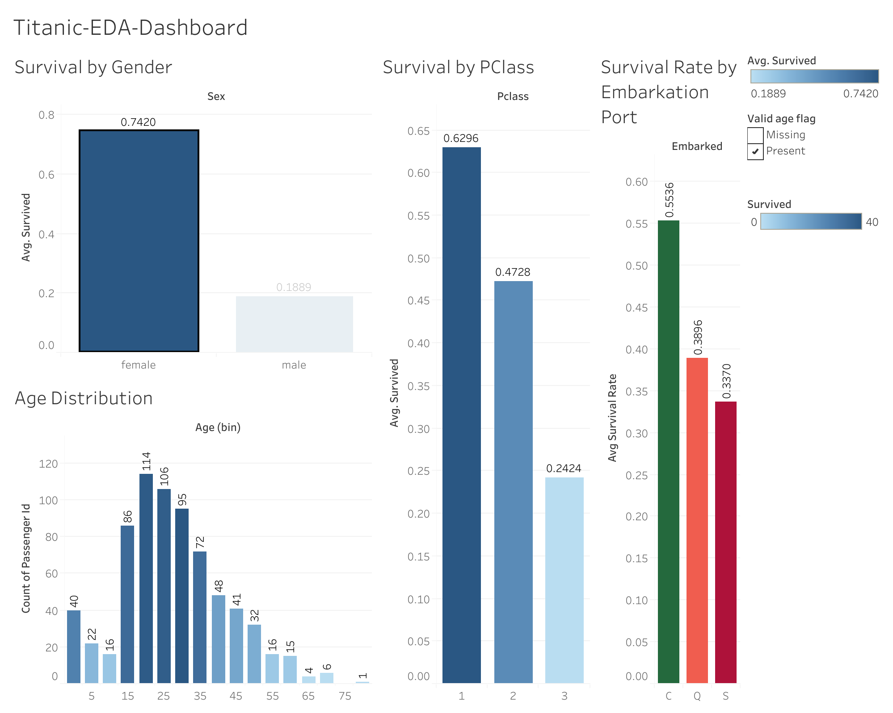

# SCT_DS_2
EDA of Titanic dataset using Tableau.  Visual analysis of survival patterns, demographics, and class distribution.

# Titanic EDA Dashboard

This repository contains an Exploratory Data Analysis (EDA) dashboard created using Tableau on the Titanic dataset.

## 📊 Dashboard Preview

## 📁 Dataset
The Titanic dataset used is from Kaggle: [https://www.kaggle.com/c/titanic](https://www.kaggle.com/c/titanic)

## 🔍 Key Insights
- Survival rate varied greatly by **gender** and **passenger class**
- Children and women in 1st class had the highest survival rates
- Most passengers were in 3rd class and male
- Higher fare seemed to increase survival probability

## 🛠️ Tools Used
- Tableau
- Titanic CSV Dataset

## 📎 Files
- `Titanic-EDA-Dashboard.png` – Final dashboard image

## ✨ Author
RagaVarshini BS
